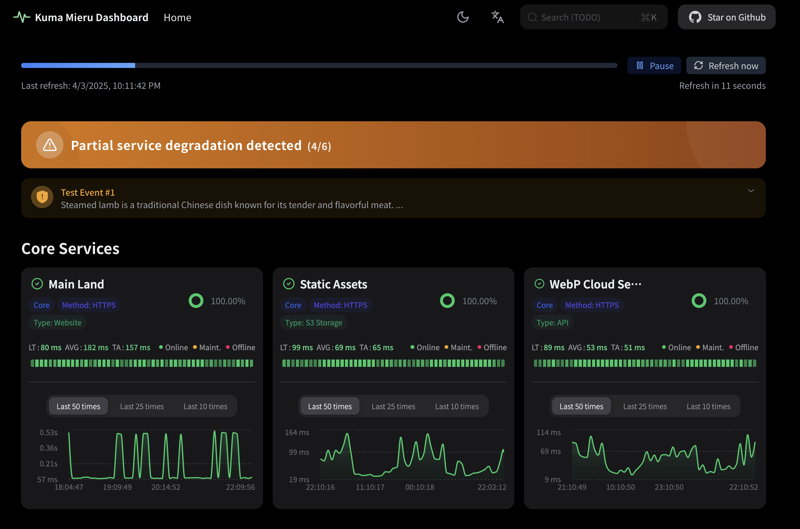
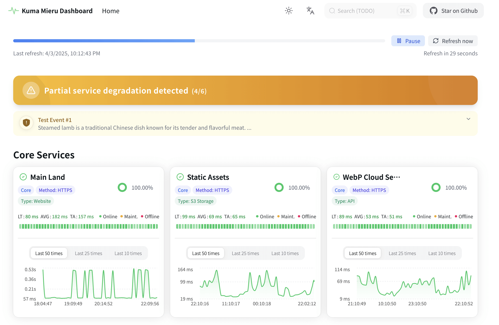

# Kuma Mieru :traffic_light:

**Kuma Mieru - A Modern Third-Party Monitoring Dashboard for Uptime Kuma**  
Built with Next.js 15, TypeScript, and Recharts, this project enhances Uptime Kuma's public status pages with intuitive visualizations and latency charts.

[中文版](README.md) | [English Version](README.en.md)

> [!WARNING]
> New version (v1.1.4+) has refactored the time processing logic,
>
> please note to modify the `Display Timezone` (Display Timezone) to `UTC+0` time zone in the _Uptime Kuma_ settings.

## Key Features :sparkles:

- **Real-Time Monitoring & Auto-Refresh** :arrows_clockwise: Live status updates without manual refreshing.
- **Elegant Responsive UI** :art: Modern interface powered by **HeroUI components**, optimized for all devices.
- **Interactive Analytics** :chart_with_upwards_trend: Explore node latency/status data through **Recharts-powered visualizations**.
- **Multi-Theme Support** :bulb: Dark/Light/System themes with automatic detection.
- **Maintenance Announcements**: Native support for Uptime Kuma's **incident updates** and **status events**.

## Preview :camera:

| Dark Mode                               | Light Mode                                |
| --------------------------------------- | ----------------------------------------- |
|  |  |

## Deployment :star:

### Vercel Deployment (Recommended)

#### 1. Fork Repository

1. Click [Fork](https://github.com/Alice39s/kuma-mieru/fork) button to fork this repository to your GitHub account.
2. Click `Create fork` button to create a new fork.

> [!NOTE]
> Please ensure your forked repository is public, otherwise you may encounter issues when synchronizing updates.

#### 2. Import to Vercel

Go to https://vercel.com/new, select **Import** to import the repository you just forked.

#### 3. Configure Environment Variables

1. Click `Environment Variables` to add the following two environment variables:  
   `UPTIME_KUMA_BASE_URL` and `PAGE_ID`.

2. Click the `Deploy` button to deploy instantly on Vercel.

#### 4. Update Repository

1. Enter your forked GitHub repository, click the `Sync fork` button.
2. Click the `Update branch` button, and follow the prompts to automatically synchronize the latest code from this repository.

### Local Installation

1. **Clone Repository**

   ```bash
   git clone https://github.com/Alice39s/kuma-mieru.git
   cd kuma-mieru
   ```

2. **Install Dependencies**

   Kuma Mieru uses [Bun](https://bun.sh/) as its package manager, please install Bun first:

   ```bash
   # Linux/macOS
   curl -fsSL https://bun.sh/install | bash
   # Windows
   powershell -c "irm bun.sh/install.ps1 | iex"
   ```

   Then install the dependencies:

   ```bash
   bun install
   ```

3. **Configure Environment**  
   Copy `.env.example` to `.env` and modify:

   ```bash
   UPTIME_KUMA_BASE_URL=https://your-kuma-instance.com
   PAGE_ID=your_status_page_id
   ```

   _Example: For URL `https://status.kuma-mieru.invalid/status/prod`, set:  
   `UPTIME_KUMA_BASE_URL=https://status.kuma-mieru.invalid`  
   `PAGE_ID=prod`_

4. **Start Development Server**

   ```bash
   bun run dev
   ```

   Access at: [http://localhost:3883](http://localhost:3883)

5. **Production Build**
   ```bash
   bun run build
   bun run start
   ```

## Docker Deployment :whale: (Beta)

### Using Docker Compose (Recommended)

1. **Clone Repository**

   ```bash
   git clone https://github.com/Alice39s/kuma-mieru.git
   cd kuma-mieru
   ```

2. **Configure Environment Variables**  
   Duplicate the `.env.example` file to create your `.env` file:

   ```bash
   cp .env.example .env
   ```

   Edit the `.env` file with required configurations:

   ```
   UPTIME_KUMA_BASE_URL=https://example.kuma-mieru.invalid
   PAGE_ID=your-status-page-id
   ```

3. **Start Services**

   ```bash
   docker compose up -d
   ```

   Add `--build` flag to bypass build cache if needed:

   ```bash
   docker compose up -d --build
   ```

   Service will be available at `http://0.0.0.0:3883`.

4. **View Logs**

   ```bash
   docker compose logs -f
   ```

### Manual Docker Deployment

1. **Build Image**

   ```bash
   docker build -t kuma-mieru .
   ```

2. **Modify Environment Variables**

   ```bash
   cp .env.example .env
   ```

   Please refer to the [Environment Variables](#environment-variables) section for more details.

3. **Run Container**

   ```bash
   docker run -d \
     --name kuma-mieru \
     -p 3883:3000 \
     -e UPTIME_KUMA_BASE_URL=https://example.kuma-mieru.invalid \
     -e PAGE_ID=your-status-page-id \
     kuma-mieru
   ```

### Environment Variables

| Variable Name            | Required | Description                             | Example                            |
| ------------------------ | -------- | --------------------------------------- | ---------------------------------- |
| UPTIME_KUMA_BASE_URL     | Yes      | Base URL of Uptime Kuma instance        | https://example.kuma-mieru.invalid |
| PAGE_ID                  | Yes      | Status page path of Uptime Kuma         | test1                              |
| FEATURE_EDIT_THIS_PAGE   | No       | Whether to show "Edit This Page" button | false                              |
| FEATURE_SHOW_STAR_BUTTON | No       | Whether to show "Star on Github" button | true                               |
| FEATURE_TITLE            | No       | Custom page title                       | My Monitoring Dashboard            |
| FEATURE_DESCRIPTION      | No       | Custom page description                 | A beautiful monitoring dashboard   |
| FEATURE_ICON             | No       | Custom page icon URL                    | /icon.svg                       |

### Health Check

The Docker container includes a built-in health check mechanism that verifies service status every 30 seconds. The health check API endpoint is `/api/health`, returning:

```json
{
  "status": "ok",
  "timestamp": "2024-03-20T12:34:56.789Z",
  "uptime": 123.456
}
```

Check container health status using:

```bash
docker ps
```

Or via Docker Compose:

```bash
docker compose ps
```

Directly access the health check API:

```bash
curl http://localhost:3883/api/health
```

## Integration with Uptime Kuma :link:

> [!NOTE]
> For the latest stable version of Uptime Kuma (v1.23.0+), Kuma Mieru has been fully tested and is compatible.
>
> If you are using an older version, please refer to the [Uptime Kuma official documentation](https://github.com/louislam/uptime-kuma/wiki/%F0%9F%86%99-How-to-Update) to try to upgrade to the latest stable version (v1.23.0+), and remember to back up your data.

Seamlessly works with the popular self-hosted monitoring tool:  
[Uptime Kuma](https://github.com/louislam/uptime-kuma)

**Prerequisites**:

1. A running Uptime Kuma instance
2. Change `Display Timezone` to any `UTC+0` time zone in the Uptime Kuma settings.
3. Created status page in Uptime Kuma
4. Correct environment variables configuration

## FAQ :question:

### Why is the time I see in Kuma Mieru offset from the time I see in Uptime Kuma?

Since the time passed from the Uptime Kuma backend to the frontend **doesn't carry time zone information**, Kuma Mieru **automatically converts the time to the UTC+0 time zone** and displays it in order to facilitate development.

If you find that the time zone is shifted, please go to Uptime Kuma settings and change `Display Timezone` to any `UTC+0` time zone.

### Is Uptime Robot / Better Stack / other monitoring data sources compatible?

Kuma Mieru was designed to address the shortcomings of Uptime Kuma, so v1 does not consider supporting other monitoring data sources for now.

However, v2 may consider to support API interface of other monitoring tools such as Uptime Robot / Better Stack.

## Contribution Guide :handshake:

We welcome contributions! Please review:  
[CONTRIBUTING.md](CONTRIBUTING.md) for development guidelines.

## Star History :star2:

<a href="https://github.com/Alice39s/kuma-mieru/stargazers" target="_blank" style="display: block" align="center">
  <picture>
    <source media="(prefers-color-scheme: dark)" srcset="https://api.star-history.com/svg?repos=Alice39s/kuma-mieru&type=Timeline&theme=dark" />
    <source media="(prefers-color-scheme: light)" srcset="https://api.star-history.com/svg?repos=Alice39s/kuma-mieru&type=Timeline" />
    
  </picture>
</a>

## License :lock:

Open-sourced under [MPL-2.0](LICENSE) (Mozilla Public License 2.0).
