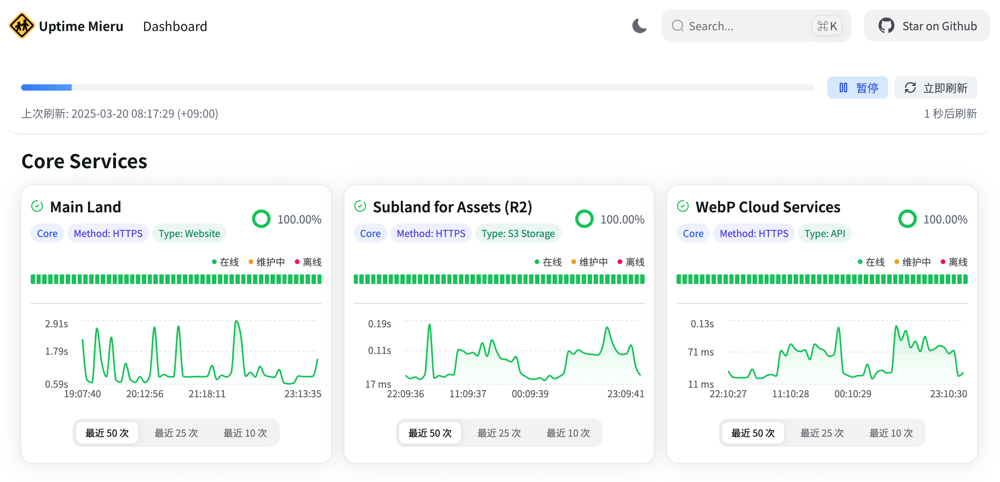

# Kuma Mieru :traffic_light:

**Kuma Mieru 是一款基于 Next.js 15、TypeScript 和 Recharts 构建的第三方 Uptime Kuma 监控仪表盘。** 本项目尝试使用 Recharts + Next.js 解决 Uptime Kuma 公开监控页面不够直观、没有延迟图表的缺点。

[中文版](README.md) | [English Version](README.en.md)

> [!NOTE]
> 本项目支持自动同步上游仓库功能，Fork 本仓库后可以自行前往 GitHub 仓库的 `Actions` 页面
>
> 并找到 `Auto Update from Upstream` workflow 后手动 Enable 此工作流。

## 功能亮点 :sparkles:

- **实时监控，自动刷新** :arrows_clockwise:：状态显示**实时更新**，无需手动刷新，随时掌握最新动态。
- **美观响应式界面** :art:：采用 **HeroUI 组件** 构建，界面更加现代，**完美适配**各种设备屏幕。
- **交互式图表** :chart_with_upwards_trend:：利用 **Recharts** 图表库实现数据可视化，可以 **交互式** 地查看各节点的延迟、状态等数据。
- **多主题支持** :bulb:：提供 **暗色** / **亮色** / **系统** 多种主题，满足不同偏好。
- **维护公告**：支持 Uptime Kuma 的 **事件公告** 和 **状态更新** 特性，实时同步更高效。

## 测试截图 :camera:

| Dark Mode                            | Light Mode                             |
| ------------------------------------ | -------------------------------------- |
|  |  |

## 快速部署 :star:

### 使用 Vercel 部署 (推荐)

#### 1. Fork 仓库

Fork 本仓库到您的 GitHub 用户下，如图所示：

1. 在这里 [Fork](https://github.com/Alice39s/kuma-mieru/fork) 本仓库
2. 点击 `Create fork` 按钮

> [!NOTE]
> 请确保您 Fork 的仓库是公开的，否则后续可能无法快速同步本仓库的更新。

#### 2. 导入到 Vercel

进入 https://vercel.com/new ，选择 Import 刚才 Fork 的仓库，如图所示：


#### 3. 配置环境变量

1. 点击 `Environment Variables` 添加 `UPTIME_KUMA_BASE_URL` 和 `PAGE_ID` 两个环境变量，如图所示：


2. 点击 `Deploy` 按钮即可一键部署到 Vercel

#### 4. 更新仓库

1. 进入你 Fork 的 GitHub 仓库，点击 `Sync fork` 按钮
2. 点击 `Update branch` 按钮，即可自动同步本仓库的最新代码

### 本地部署

只需简单几步，即可快速启动 Kuma Mieru：

1. **克隆仓库**

   ```bash
   git clone https://github.com/Alice39s/kuma-mieru.git
   cd kuma-mieru
   ```

2. **安装依赖**

   Kuma Mieru 使用 [Bun](https://bun.sh/) 作为包管理器，您需要先安装 Bun：

   ```bash
   # Linux/macOS
   curl -fsSL https://bun.sh/install | bash
   # Windows
   powershell -c "irm bun.sh/install.ps1 | iex"
   ```

   然后再安装依赖包：

   ```bash
   bun install
   ```

3. **配置环境变量**
   复制 `.env.example` 文件为 `.env`：

   ```bash
   cp .env.example .env
   ```

   `.env` 文件中 **必填** 的环境变量，可参考 [环境变量配置](#环境变量配置) 章节。

4. **启动开发服务器**

   ```bash
   bun run dev
   ```

5. **访问仪表盘**
   打开浏览器，访问 [http://localhost:3883](http://localhost:3883) 即可查看您的 Kuma Mieru 监控仪表盘。

6. **部署上线**

   ```bash
   bun run build
   bun run start
   ```

## Docker 部署 :whale: (Beta)

> [!WARNING]
> Docker 镜像正在测试中，请勿用于生产环境!

### 使用 Docker Compose（推荐）

1. **克隆仓库**

   ```bash
   git clone https://github.com/Alice39s/kuma-mieru.git
   cd kuma-mieru
   ```

2. **配置环境变量**
   复制 `.env.example` 文件并创建 `.env` 文件：

   ```bash
   cp .env.example .env
   ```

   参考 [环境变量配置](#环境变量配置) 章节，配置必要的环境变量。

3. **启动服务**

   ```bash
   docker compose up -d
   ```

   > [!NOTE]
   > 如果需要绕过 build 缓存，可以添加 `--build` 参数：

   ```bash
   docker compose up -d --build
   ```

   服务将在 `http://0.0.0.0:3883` 上运行。

4. **查看日志**

   ```bash
   docker compose logs -f
   ```

### Docker Run 部署

#### 1. 获取容器镜像

**方式一：拉取预构建镜像**（推荐）

```bash
docker pull ghcr.io/alice39s/kuma-mieru:main
```

**方式二：从源码构建镜像**

```bash
docker build -t kuma-mieru .
```

---

#### 2. 启动容器服务

> [!NOTE]
> 请参考 [环境变量配置](#环境变量配置) 章节，修改下文中的 `UPTIME_KUMA_BASE_URL` 和 `PAGE_ID` 变量。

**方式一：使用预构建镜像**

```bash
docker run -d \
  --name kuma-mieru \
  -p 3883:3000 \
  -e UPTIME_KUMA_BASE_URL="..." \
  -e PAGE_ID="..." \
  ghcr.io/alice39s/kuma-mieru:main
```

**方式二：使用源码构建镜像**

```bash
docker run -d \
  --name kuma-mieru \
  -p 3883:3000 \
  -e UPTIME_KUMA_BASE_URL="..." \
  -e PAGE_ID="..." \
  kuma-mieru
```

## 环境变量配置

假如您的 Uptime Kuma 的状态页面 URL 为 `https://example.kuma-mieru.invalid/status/test1`，那么您需要配置的环境变量如下：

| 变量名               | 必填 | 说明                       | 示例                               |
| -------------------- | ---- | -------------------------- | ---------------------------------- |
| UPTIME_KUMA_BASE_URL | 是   | Uptime Kuma 实例的基础 URL | https://example.kuma-mieru.invalid |
| PAGE_ID              | 是   | 状态页面 ID                | test1                              |

## 项目结构 :file_folder:

Kuma Mieru 使用 Next.js 15 (App Router) 构建，具体的项目结构如下：

```
kuma-mieru/
├── app/                   # Next.js 应用目录
│   ├── api/               # API 路由
│   ├── layout.tsx         # 主布局
│   └── page.tsx           # 主页
├── components/            # React 组件
│   ├── ...
├── config/                # 配置文件
│   ├── ...
├── public/                # 静态文件
├── services/              # 服务组件
├── styles/                # 全局样式
├── types/                 # TypeScript 类型定义
├── utils/                 # 工具函数
├── tailwind.config.js     # Tailwind CSS 配置
├── next.config.js         # Next.js 配置
├── .env.example           # 配置文件示例
├── ...
```

## 与 Uptime Kuma 集成 :link:

Kuma Mieru 与备受好评的开源监控工具 [Uptime Kuma](https://github.com/louislam/uptime-kuma) 无缝集成，您只需要：

1. **安装并配置 Uptime Kuma**
2. **在 Uptime Kuma 中创建 "状态页面"**
3. **在 `.env` 文件中配置环境变量**

## 贡献指南 :handshake:

非常欢迎您为 Kuma Mieru 项目作出贡献！

如果您有任何想法或建议，请参阅 [CONTRIBUTING.md](CONTRIBUTING.md) 了解详细的贡献方式。

## 开源许可 :lock:

本项目采用 [MPL-2.0](LICENSE) (Mozilla Public License Version 2.0) 开源许可证。
