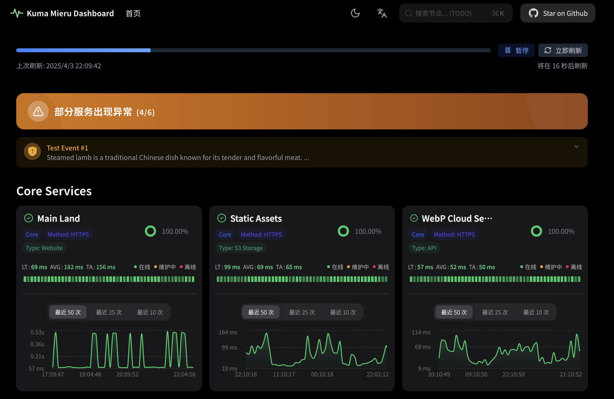
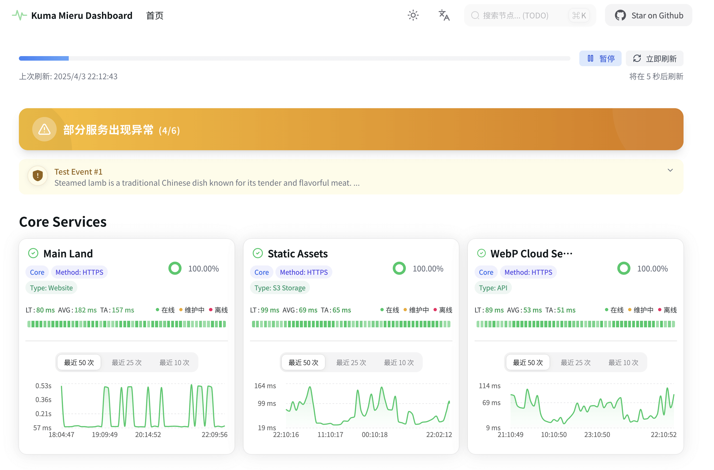
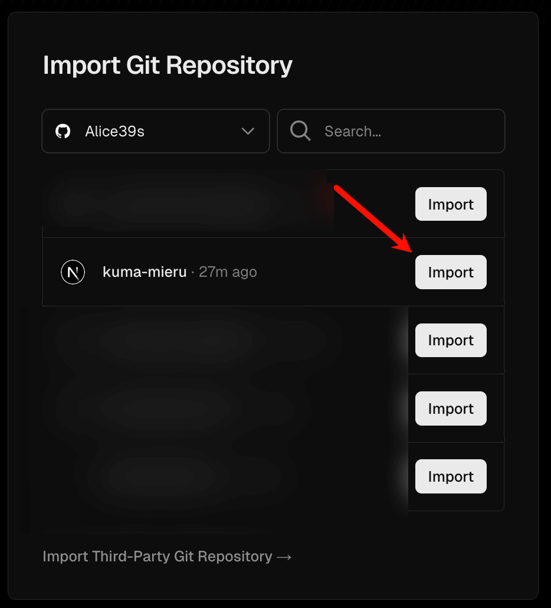

# Kuma Mieru :traffic_light:

Kuma Mieru 是一款基于 Next.js 15、TypeScript 和 Recharts 构建的第三方 Uptime Kuma 监控仪表盘。

本项目使用 Recharts 解决了 Uptime Kuma 内建公开状态页面不够直观、没有延迟图表等痛点。

中文版 | [English Version](README.en.md)

> [!WARNING]
> 新版 (v1.1.4+) 重构了时间处理逻辑，请注意修改 _Uptime Kuma_ 后台设置的 `Display Timezone` (显示时区) 为 `UTC+0` 时区。

<div align="center">

<!-- Release -->

[](https://github.com/Alice39s/kuma-mieru/releases/latest) [](https://github.com/Alice39s/kuma-mieru/blob/main/LICENSE) [](https://github.com/Alice39s/kuma-mieru/actions/workflows/release.yml) [](https://github.com/Alice39s/kuma-mieru/actions/workflows/docker-build.yml)

<!-- Tech Stack -->

[](https://www.typescriptlang.org/) [](https://reactjs.org/) [](https://nextjs.org/)

[](https://bun.sh/) [](https://recharts.org/en-US/) [](https://v3.tailwindcss.com/)

<!-- Project Data -->

[](https://github.com/Alice39s/kuma-mieru/stargazers) [](https://github.com/Alice39s/kuma-mieru/network/members)

</div>

## 目录

- [目录](#目录)
- [功能亮点 :sparkles:](#功能亮点-sparkles)
- [测试截图 :camera:](#测试截图-camera)
- [快速部署 :star:](#快速部署-star)
  - [使用 Vercel 部署 (推荐)](#使用-vercel-部署-推荐)
    - [1. Fork 仓库](#1-fork-仓库)
    - [2. 导入到 Vercel](#2-导入到-vercel)
    - [3. 配置环境变量](#3-配置环境变量)
    - [4. 更新仓库](#4-更新仓库)
  - [本地部署](#本地部署)
- [Docker 部署 :whale: (Beta)](#docker-部署-whale-beta)
  - [使用 Docker Compose（推荐）](#使用-docker-compose-推荐)
  - [Docker Run 部署](#docker-run-部署)
    - [1. 获取容器镜像](#1-获取容器镜像)
    - [2. 修改环境变量](#2-修改环境变量)
    - [3. 启动容器服务](#3-启动容器服务)
- [环境变量配置](#环境变量配置)
- [与 Uptime Kuma 集成 :link:](#与-uptime-kuma-集成-link)
- [FAQ :question:](#faq-question)
  - [为什么我在 Kuma Mieru 中看到的时间与 Uptime Kuma 中有偏移？](#为什么我在-kuma-mieru-中看到的时间与-uptime-kuma-中有偏移)
  - [请问兼容 Uptime Robot / Better Stack / 其他监控数据源吗？](#请问兼容-uptime-robot-better-stack-其他监控数据源吗)
- [贡献指南 :handshake:](#贡献指南-handshake)
- [Star History :star2:](#star-history-star2)
- [开源许可 :lock:](#开源许可-lock)

## 功能亮点 :sparkles:

- **实时监控，自动刷新** :arrows_clockwise:：状态显示**实时更新**，无需手动刷新，随时掌握最新动态。
- **美观响应式界面** :art:：采用 **HeroUI 组件** 构建，界面更加现代，**完美适配**各种设备屏幕。
- **交互式图表** :chart_with_upwards_trend:：利用 **Recharts** 图表库实现数据可视化，可以 **交互式** 地查看各节点的延迟、状态等数据。
- **多主题支持** :bulb:：提供 **暗色** / **亮色** / **系统** 多种主题，满足不同偏好。
- **维护公告**：支持 Uptime Kuma 的 **事件公告** 和 **状态更新** 特性，实时同步更高效。

## 测试截图 :camera:

| Dark Mode                               | Light Mode                                |
| --------------------------------------- | ----------------------------------------- |
|  |  |

## 快速部署 :star:

### 使用 Vercel 部署 (推荐)

#### 1. Fork 仓库

Fork 本仓库到您的 GitHub 用户下，如图所示：

1. 在这里 [Fork](https://github.com/Alice39s/kuma-mieru/fork) 本仓库
2. 点击 `Create fork` 按钮

> [!NOTE]
> 请确保您 Fork 的仓库是公开的，否则后续可能无法快速同步本仓库的更新。
>
> 请放心，您所有的配置均使用环境变量配置，Fork 的代码库 **不会泄漏** 您的任何配置信息。

#### 2. 导入到 Vercel

进入 https://vercel.com/new ，选择 Import 刚才 Fork 的仓库，如图所示：



#### 3. 配置环境变量

> [!NOTE]
> 请确保您已经配置了 `UPTIME_KUMA_BASE_URL` 和 `PAGE_ID` 两个环境变量，否则无法正常显示监控数据。
>
> 关于 `UPTIME_KUMA_BASE_URL` 和 `PAGE_ID` 等配置，请参考 [环境变量配置](#环境变量配置) 一节。

1. 点击 `Environment Variables` 添加 `UPTIME_KUMA_BASE_URL` 和 `PAGE_ID` 两个环境变量，如图所示：


2. 点击 `Deploy` 按钮即可一键部署到 Vercel

#### 4. 更新仓库

1. 进入你 Fork 的 GitHub 仓库，点击 `Sync fork` 按钮
2. 点击 `Update branch` 按钮，即可自动同步本仓库的最新代码

### 本地部署

只需简单几步，即可快速启动 Kuma Mieru：

1. **克隆仓库**

   ```bash
   git clone https://github.com/Alice39s/kuma-mieru.git
   cd kuma-mieru
   ```

2. **安装依赖**

   Kuma Mieru 使用 [Bun](https://bun.sh/) 作为包管理器，您需要先安装 Bun：

   ```bash
   # Linux/macOS
   curl -fsSL https://bun.sh/install | bash
   # Windows
   powershell -c "irm bun.sh/install.ps1 | iex"
   ```

   然后再安装依赖包：

   ```bash
   bun install
   ```

3. **配置环境变量**
   复制 `.env.example` 文件为 `.env`：

   ```bash
   cp .env.example .env
   ```

   `.env` 文件中 **必填** 的环境变量，可参考 [环境变量配置](#环境变量配置) 章节。

4. **启动开发服务器**

   ```bash
   bun run dev
   ```

5. **访问仪表盘**
   打开浏览器，访问 [http://localhost:3883](http://localhost:3883) 即可查看您的 Kuma Mieru 监控仪表盘。

6. **部署上线**

   ```bash
   bun run build
   bun run start
   ```

## Docker 部署 :whale: (Beta)

### 使用 Docker Compose（推荐）

1. **克隆仓库**

   ```bash
   git clone https://github.com/Alice39s/kuma-mieru.git
   cd kuma-mieru
   ```

2. **配置环境变量**
   复制 `.env.example` 文件并创建 `.env` 文件：

   ```bash
   cp .env.example .env
   ```

   参考 [环境变量配置](#环境变量配置) 章节，配置必要的环境变量。

3. **启动服务**

   ```bash
   docker compose up -d
   ```

   服务将在 `http://0.0.0.0:3883` 上运行。

4. **查看日志**

   ```bash
   docker compose logs -f
   ```

5. **更新镜像**

   ```bash
   docker compose pull
   docker compose up -d
   ```

### Docker Run 部署

#### 1. 获取容器镜像

**从源码构建镜像**

```bash
docker build -t kuma-mieru .
```

#### 2. 修改环境变量

复制 `.env.example` 文件并创建 `.env` 文件：

```bash
cp .env.example .env
```

请参考 [环境变量配置](#环境变量配置) 章节，修改 `.env` 文件中的 `UPTIME_KUMA_BASE_URL` 和 `PAGE_ID` 变量。

#### 3. 启动容器服务

**使用源码构建镜像**

```bash
docker run -d \
  --name kuma-mieru \
  -p 3883:3000 \
  -e UPTIME_KUMA_BASE_URL="..." \
  -e PAGE_ID="..." \
  kuma-mieru
```

## 环境变量配置

首先，假设您的 Uptime Kuma 的状态页面 URL 为 `https://example.kuma-mieru.invalid/status/test1`

那么您需要配置的环境变量如下：

| 变量名                   | 必填 | 说明                           | 示例/默认值                                        |
| ------------------------ | ---- | ------------------------------ | -------------------------------------------------- |
| UPTIME_KUMA_BASE_URL     | Yes  | Uptime Kuma 实例的基础 URL     | https://example.kuma-mieru.invalid                 |
| PAGE_ID                  | Yes  | Uptime Kuma 实例的状态页面 ID  | test1                                              |
| FEATURE_EDIT_THIS_PAGE   | No   | 是否展示 "Edit This Page" 按钮 | false                                              |
| FEATURE_SHOW_STAR_BUTTON | No   | 是否展示 "Star on Github" 按钮 | true                                               |
| FEATURE_TITLE            | No   | 自定义页面标题                 | Kuma Mieru                                         |
| FEATURE_DESCRIPTION      | No   | 自定义页面描述                 | A beautiful and modern uptime monitoring dashboard |
| FEATURE_ICON             | No   | 自定义页面图标URL              | /icon.svg                                          |

## 与 Uptime Kuma 集成 :link:

> [!NOTE]
> 经测试，本项目兼容 Uptime Kuma 的最新稳定版本 (v1.23.0+)
>
> 如您使用的版本较低，请参考 [Uptime Kuma 官方文档](https://github.com/louislam/uptime-kuma/wiki/%F0%9F%86%99-How-to-Update) 尝试升级到最新稳定版 (v1.23.0+)，注意备份好数据。

Kuma Mieru 与备受好评的开源监控工具 [Uptime Kuma](https://github.com/louislam/uptime-kuma) 无缝集成，您只需要：

1. 安装并配置 Uptime Kuma
2. 在 Uptime Kuma 设置中修改 `Display Timezone` (显示时区) 为任意 `UTC+0` 时区
3. 在 Uptime Kuma 中创建 "状态页面"
4. 在 `.env` 文件中配置环境变量

## FAQ :question:

### 为什么我在 Kuma Mieru 中看到的时间与 Uptime Kuma 中有偏移？

由于 Uptime Kuma 后端传递到前端的时间 **没有携带时区信息**，为了方便开发，Kuma Mieru 会 **自动将时间转换为 UTC+0 时区** 并显示。

如果您发现时区偏移，请前往 Uptime Kuma 设置中修改 `Display Timezone` (显示时区) 为任意 `UTC+0` 时区。

### 请问兼容 Uptime Robot / Better Stack / 其他监控数据源吗？

Kuma Mieru 设计之初就是为了解决 Uptime Kuma 的不足，所以 v1 暂时不考虑支持其他监控数据源。

不过 v2 版本可能会考虑支持 Uptime Robot / Better Stack 等其他监控工具的 API 接口。

## 贡献指南 :handshake:

非常欢迎您为 Kuma Mieru 项目作出贡献！

如果您有任何想法或建议，请参阅 [CONTRIBUTING.md](CONTRIBUTING.md) 了解详细的贡献方式。

## Star History :star2:

<a href="https://github.com/Alice39s/kuma-mieru/stargazers" target="_blank" style="display: block" align="center">
  <picture>
    <source media="(prefers-color-scheme: dark)" srcset="https://api.star-history.com/svg?repos=Alice39s/kuma-mieru&type=Timeline&theme=dark" />
    <source media="(prefers-color-scheme: light)" srcset="https://api.star-history.com/svg?repos=Alice39s/kuma-mieru&type=Timeline" />
    
  </picture>
</a>

## 开源许可 :lock:

本项目采用 [MPL-2.0](LICENSE) (Mozilla Public License Version 2.0) 开源许可证。
